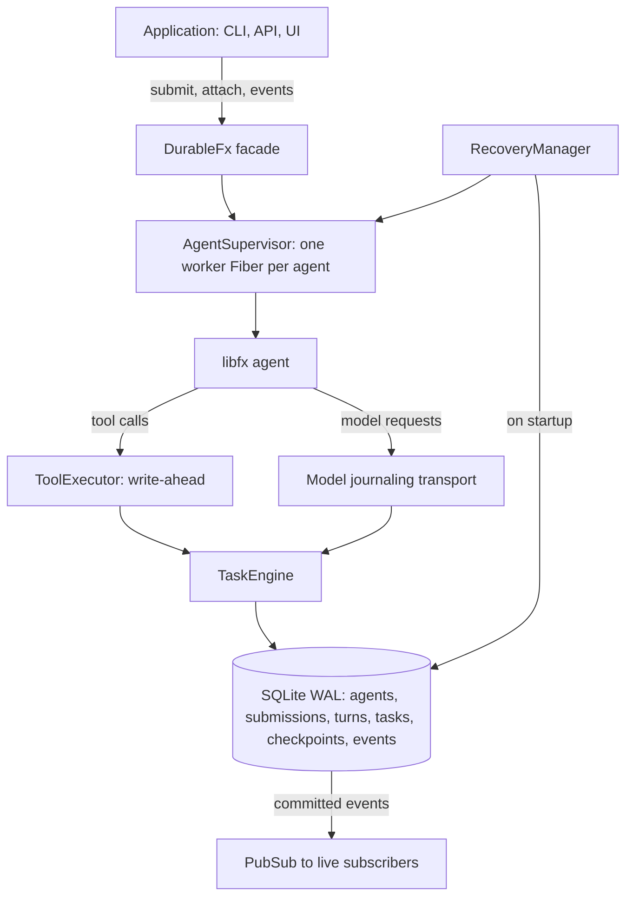

<div align="center">

# fx-durable

Agents should outlive their processes.

[](https://nodejs.org/api/sqlite.html)
[](tsconfig.json)
[](https://effect.website)
[](src/sqlite/storage.ts)

</div>

## What is this?

fx-durable is a durability layer for [libfx](https://github.com/vercel-labs/fx/tree/main/sdk) agents. When the process
crashes, the machine restarts, or the client disconnects, the agent recovers and carries on. It never reports an
uncertain side effect as a success.

libfx still runs the agent loop, model calls and checkpoints. fx-durable adds the persistence around it: an execution
journal in SQLite, crash recovery, replay rules for tools, stable agent identity, and an event log clients can
reconnect to.

> **Effect models execution. SQLite models durability. libfx models the agent.**

## Quick Start

```bash
pnpm install
pnpm build
node dist/cli/main.js demo
```

The demo runs an agent that builds a small Hacker News client and then deploys it. It prints its pid. Run
`kill -9 <pid>` at any point, then start it again:

```text
Recovering agent engineer...

✗ npm test interrupted
✓ bash was replay-safe — replaying
✓ restored checkpoint
✓ recovered interrupted turn

Continuing...
```

To see the important case, kill it after the deploy has started but before its result is saved:

```bash
node dist/cli/main.js demo --reset --crash-at tool.after-execute:deploy
node dist/cli/main.js demo
```

```text
⚠ Interrupted external operation

  deploy
  environment: production
  version: abc123

  Outcome unknown.
  Operation will NOT be replayed automatically.

● model
  The previous deploy may or may not have happened. Inspecting deployment state before doing anything.
```

The demo uses a scripted model that speaks the AI Gateway protocol, so it runs offline and gives the same output every
time. The libfx kernel underneath is real.

## Usage

```ts
import { Schema } from "effect"
import { DurableFx, defineDurableTool, sqlite } from "fx-durable"

const search = defineDurableTool({
  name: "search",
  replay: "safe",
  inputSchema: Schema.Struct({ query: Schema.String }),
  execute: ({ query }) => searchCode(query)
})

const deploy = defineDurableTool({
  name: "deploy",
  replay: "unsafe",
  inputSchema: Schema.Struct({ version: Schema.String }),
  execute: ({ version }, { signal }) => deployVersion(version, { signal })
})

const fx = await DurableFx.open({
  storage: sqlite("./fx.db"),
  runtimes: { "coding-v1": { tools: [search, deploy] } }
})

const agent = await fx.agent("engineer", { runtime: "coding-v1", model: "anthropic/claude-sonnet-4.5" })
const submission = await agent.submit("Fix issue #382", { requestId: "github-382" })

for await (const event of submission.events()) console.log(event.type)
const result = await submission.result() // { text, stopReason, usage }
```

Credentials come from `AI_GATEWAY_API_KEY` or `DurableFx.open({ apiKey })`. Opening the runtime recovers interrupted
work. Pass `recovery: "manual"` to do that later with `fx.resume()`.

### Without Effect

fx-durable is built on Effect, but the main `fx-durable` entry doesn't require it. Every call returns a Promise or an
AsyncIterable, errors are ordinary `Error` subclasses with a `_tag`, and records are plain objects. Tool input can
be validated with any [Standard Schema](https://standardschema.dev) library:

```ts
import { z } from "zod"
import { DurableFx, defineDurableTool, sqlite } from "fx-durable"

const forecast = defineDurableTool({
  name: "forecast",
  replay: "safe",
  inputSchema: z.object({ city: z.string(), days: z.number().int().min(1).max(7) }),
  execute: ({ city, days }) => getForecast(city, days)
})
```

The JSON Schema the model sees comes from the validator when it implements Standard JSON Schema, as Zod 4 does.
Otherwise pass `jsonSchema` yourself. A plain JSON Schema object works as `inputSchema` too.

### With Effect

`fx-durable/effect` exposes the Effect-native side:
- `durableFxLayer(options)`: the whole service graph as one `Layer`.
- The service tags: `Storage`, `EventLog`, `TaskEngine`, `AgentSupervisor`, `RecoveryManager` and others.
- `sqliteLayer`.
- `openDurableFx(options, { storage, ids })`: open with your own layers.

Effect Schema works as a tool `inputSchema` directly.

### Replay policies

Each tool declares what may happen to it after a crash.

| Policy | After an interrupted execution | Examples |
|--------|--------------------------------|----------|
| `"safe"` | Replayed automatically | read file, grep, git status |
| `{ strategy: "idempotent", key }` | Retried with the same idempotency key | payment APIs that accept idempotency keys |
| `"unsafe"` | Marked `outcome_unknown` and never replayed automatically | deploy, send email, git push |

A tool that knows its request went out but can't tell whether it took effect can throw `new OutcomeUnknown(message)`.
MCP tools plug in through a runtime's `createMcpClients`. They default to `"unsafe"`; you can change that per server
with `replay` or per tool with `replayOverrides`.

Tool inputs and results are stored in the journal, so they must be JSON. Inputs are decoded with the tool's
`inputSchema`, and returning nothing records `null`.

### Reconnect and cancel

```ts
const agent = await fx.attach("engineer")
for await (const event of agent.events({ after: lastSeenSequence })) {
  // saved events after the cursor, then live events, with no gap
}

await submission.cancel()
```

A client that disconnects doesn't cancel the agent. When you cancel a submission while an unsafe tool is running, that
call is recorded as `outcome_unknown`, because stopping it locally doesn't prove the external effect was stopped.

## Guarantees

The [crash suite](tests/crash/crash-matrix.test.ts) checks each of these by killing real processes with SIGKILL.

- **Intent is saved before the effect.** Every tool and model call is saved as `running`, then executed, then its
  result is saved.
- **Unknown stays unknown.** If an unsafe tool started and no result was saved, it becomes `outcome_unknown` in both
  the task table and the event log.
- **Unsafe calls aren't replayed blindly.** The recovered agent is told the outcome is unknown and asked to check the
  current state. If the model repeats the same call anyway, the first repeat is refused and the second runs normally.
- **Finished work isn't redone.** A recovered turn that repeats a completed call gets the saved result back, and the
  tool doesn't run again.
- **Identity and idempotency live in the database.** `fx.agent("engineer")` is the same agent after every restart.
  `UNIQUE(agent_id, request_id)` dedupes submissions, and a partial unique index allows one active turn per agent.
- **Recovery can itself crash.** Every recovery step is a saved transition, so the next start picks up where it left
  off. A turn that keeps crashing moves to `needs_input` instead of retrying forever.

## How it works



libfx can only take a checkpoint while it's idle. So fx-durable writes the checkpoint in the same transaction that
marks the turn complete, which means a checkpoint never exists for an unfinished turn. When a process dies mid-turn,
recovery:

1. finds turns whose process is gone, by pid on the same host or heartbeat timeout elsewhere,
2. sorts the unfinished calls by their saved replay policy (replay, retry with the same key, or `outcome_unknown`),
3. restores the checkpoint from before the turn into a fresh libfx agent, and
4. re-prompts with the original request, every saved call and its outcome, and a warning for each unknown outcome.

Model calls are recorded by wrapping the `fetch` that libfx uses. Storage sits behind an interface that doesn't depend
on SQLite or Effect SQL. The only implementation uses Node's built-in `node:sqlite` with `synchronous=FULL`.

## CLI

`fxd` reads and controls the same database. It doesn't run agents itself.

```text
$ fxd agents --db fx.db
NAME      STATE    CURRENT TASK
engineer  running  deploy

$ fxd trace engineer
TURN #1 turn_… completed attempts: 2
├─ model                    0.09s 100→29 tok
├─ bash                     0.24s interrupted
├─ bash                     0.31s replay
└─ deploy                   0.30s attempt 2
```

| Command | What it does |
|---------|--------------|
| `fxd agents` | List agents and their current task |
| `fxd inspect <agent>` | Show state, current turn and its task journal |
| `fxd events <agent> [--after N] [--follow]` | Print the event log from a cursor |
| `fxd trace <agent> [--turn ID]` | Show the execution trace of a turn |
| `fxd recover` | Classify work left by dead processes without running anything |
| `fxd cancel <submission-id>` | Request cancellation (takes effect at the next tool or model call) |
| `fxd demo [--reset] [--crash-at POINT[:NAME]]` | Run the demo |

All commands take `--db PATH` (default `$FXD_DB` or `./fx.db`).

## Testing

```bash
pnpm test
```

The crash suite starts a real app process, kills it at a named crash point, restarts it, and checks the database and
a side-effect ledger. It covers model, tool, checkpoint, submission and recovery boundaries. After each case it
checks that:

- the unsafe effect ran at most once,
- there is one submission per `requestId`,
- no task is left running,
- every unknown outcome has its event,
- there is one checkpoint per completed turn, and
- event sequences have no gaps.

You can inject crashes into your own app the same way:

```bash
FXD_CRASH_AT=tool.after-execute FXD_CRASH_NAME=deploy node app.js
```

## Project Structure

```
fx-durable/
├── examples/
│   ├── crash-recovery/      # crash during a safe tool, replay on restart
│   ├── hello-durable/       # smallest durable agent; history survives restarts
│   ├── reconnect/           # resume an event stream from a saved cursor
│   ├── unsafe-tool/         # interrupted deploy becomes outcome_unknown
│   └── model.ts
├── src/
│   ├── cli/                 # fxd and the demo
│   ├── core/                # supervisor, turns, tasks, recovery, events, façade
│   ├── sqlite/              # node:sqlite storage and migrations
│   ├── testing/             # scripted model for offline runs
│   ├── tools/               # defineDurableTool, replay policies, executor
│   ├── types/               # libfx type declarations
│   └── index.ts
├── tests/
│   ├── crash/               # SIGKILL crash matrix
│   ├── fixtures/            # app process the crash suite kills
│   ├── idempotency/
│   ├── reconnect/
│   ├── recovery/
│   ├── state-machine/
│   ├── storage/
│   └── helpers.ts
├── GOAL.md
├── package.json
├── tsconfig.json
└── vitest.config.ts
```

## Documentation

| Resource | Description |
|----------|-------------|
| [GOAL.md](GOAL.md) | Full specification: invariants, architecture, MVP scope |
| [src/index.ts](src/index.ts) | Public API exports |
| [src/core/recovery.ts](src/core/recovery.ts) | Recovery procedure |
| [src/tools/executor.ts](src/tools/executor.ts) | Write-ahead tool execution and replay |
| [src/sqlite/migrations/001_initial.ts](src/sqlite/migrations/001_initial.ts) | Database schema and constraints |
| [tests/crash/crash-matrix.test.ts](tests/crash/crash-matrix.test.ts) | Crash matrix |
| [examples/](examples) | Runnable examples (`npx tsx examples/<name>/index.ts` after `pnpm build`) |

## Contributing

Run `pnpm typecheck && pnpm test` before opening a change. Any change that touches recovery or tool execution needs a
case in the crash suite, and the suite should pass on repeated runs before you build anything on top of it.

Out of scope for v1: Postgres or Redis, distributed workers, agent forks, durable subagents, approval workflows, and
Effect Workflow or Cluster.
